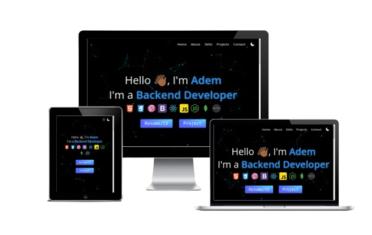

# Project – Portfolio

This is my portfolio with CV

## Table of contents

- [Overview](#overview)
  - [Screenshot](#screenshot)
  - [Links](#links)
- [My process](#my-process)
  - [Built with](#built-with)
  - [Frameworks](#frameworks)
  - [Tools](#tools)
- [Author](#author)

## Overview

### Screenshot

### Links

- Solution URL: [Github Solutions](https://github.com/Adem-Tozlu/MyPortfolio)
- Live Site URL: [Portfolio](https://my-portfolio-amber-rho-96.vercel.app/)

## My process

### Built with

- Semantic HTML5 markup
- SASS/SCSS
- Mobile-design
- Grid/Flex
- Javascript

## Frameworks
 - React

## Hooks
 - useState
 - useEffect
 - useContext

## Tools
 - Vite

## Author

- Website - [Github](https://github.com/Adem-Tozlu)
- Frontend Mentor – [@Adem-Tozlu](https://www.frontendmentor.io/profile/Adem-Tozlu)
- Linkedin - [@Adem-Tozlu](https://www.linkedin.com/in/adem-tozlu-8906b52a5)
